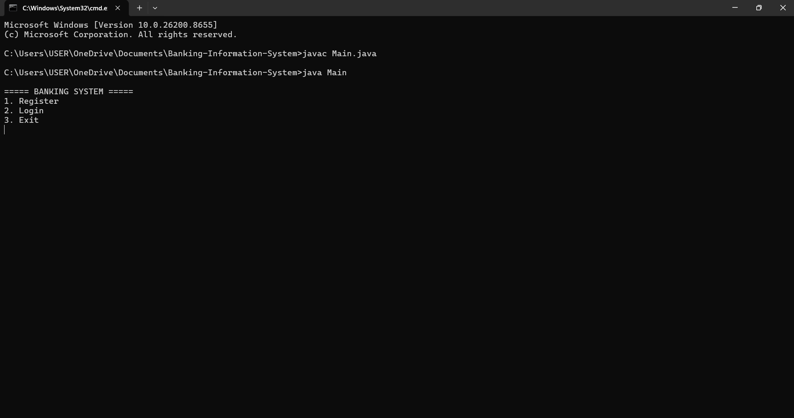
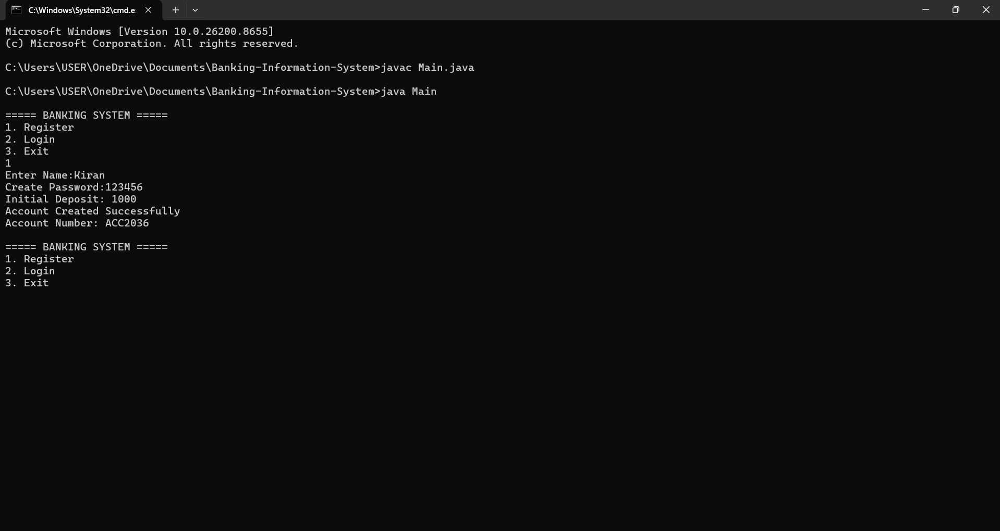
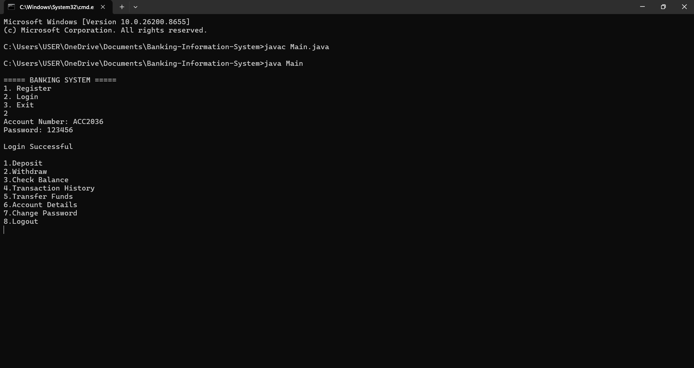
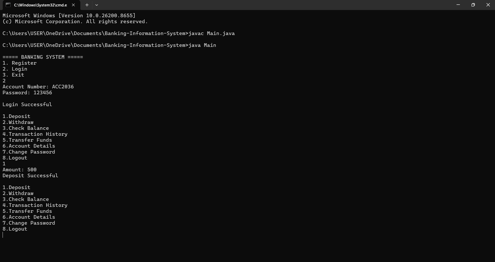
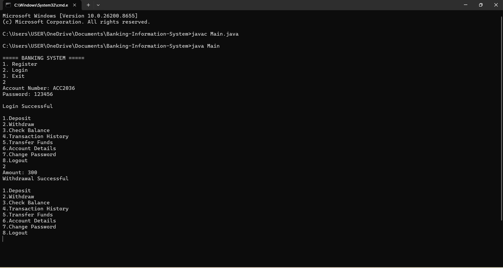
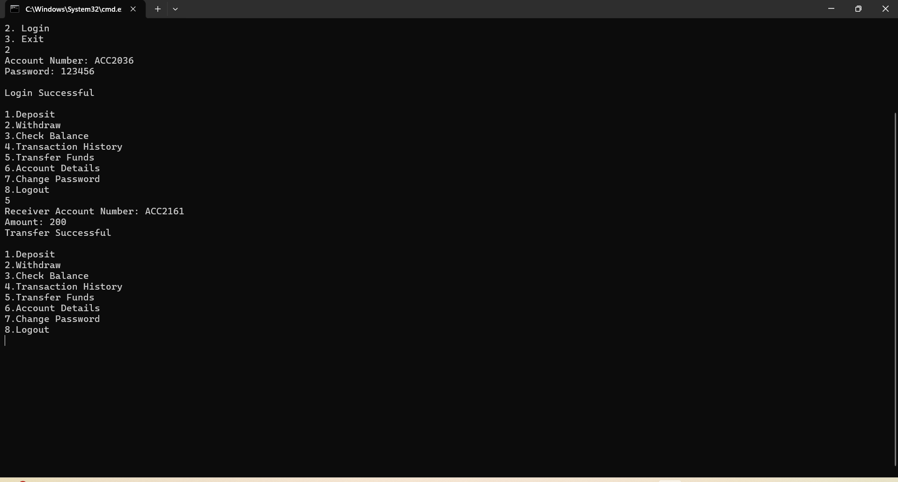
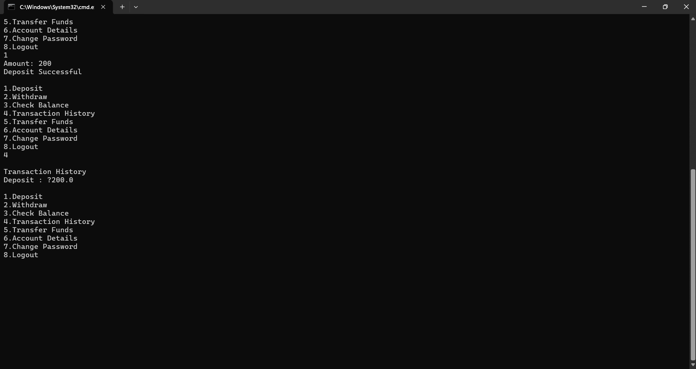
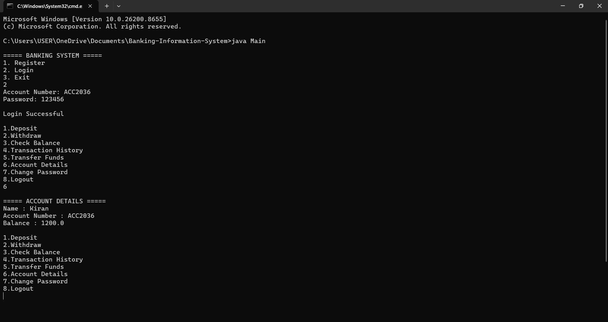

# 🏦 Banking Information System

A console-based Banking Information System developed using Core Java.

---

## 📌 Features

- User Registration
- Secure Login
- Deposit Money
- Withdraw Money
- Balance Inquiry
- Transaction History
- Fund Transfer
- Account Details
- Change Password
- File Handling

---

## 🛠 Technologies Used

- Java
- OOP
- ArrayList
- File Handling
- VS Code

---

## 📂 Project Structure

```
Banking-Information-System
│
├── Main.java
├── Bank.java
├── Account.java
├── Transaction.java
├── accounts.txt
└── README.md
```

---

## 📸 Project Screenshots

### Main Menu



### Registration



### Login



### Deposit



### Withdraw



### Transfer Funds



### Transaction History



### Account Details



---

## ▶ How to Run

Compile all Java files.

Run Main.java.

---

## 👨‍💻 Author

Kasani Kiran Sai

Core Java Internship Project
